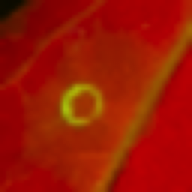
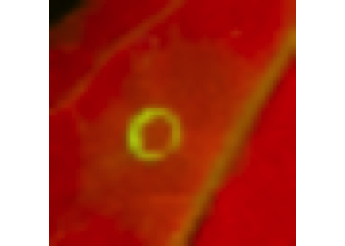
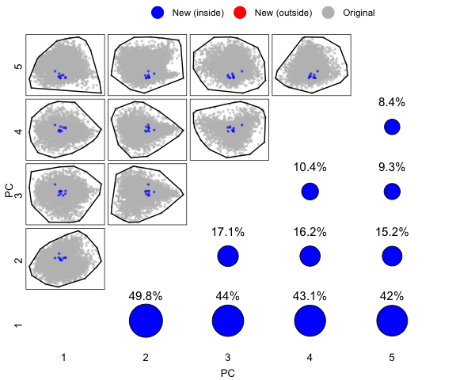
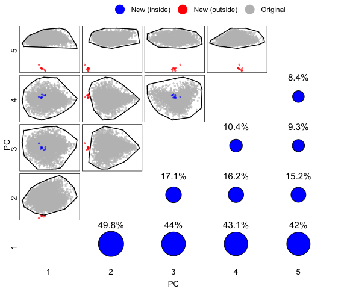
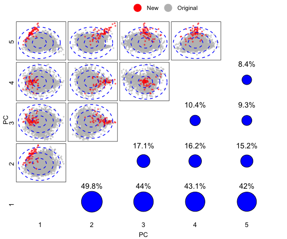
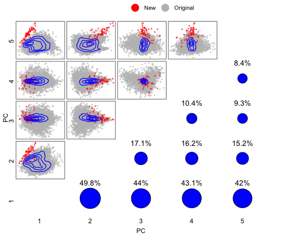
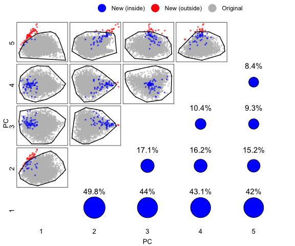

<!-- README.md is generated from README.Rmd. Please edit that file -->

# AutoCDAScorer

<!-- badges: start -->

[](https://codecov.io/gh/joshuandwilliams/AutoCDAScorer)
[](https://github.com/joshuandwilliams/AutoCDAScorer/actions/workflows/R-CMD-check.yaml)
[](https://lifecycle.r-lib.org/articles/stages.html#experimental)

[](https://www.tensorflow.org/)

<!-- badges: end -->

The goal of AutoCDAScorer is to make scoring cell death areas on UV
spectra agroinfiltration images faster, more consistent, and less
subjective.

AutoCDAScorer uses deep learning models trained on UV spectra
agroinfiltration images to automatically predict cell death severity
between 0 (no cell death) and 6 (strong cell death).

## Installation

You can install the development version of AutoCDAScorer from
[GitHub](https://github.com/) with:

``` r
install.packages("devtools")
devtools::install_github("joshuandwilliams/AutoCDAScorer")
```

The `AutoCDAScorer` package uses TensorFlow. If you already have
TensorFlow installed you can use `reticulate::use_condaenv()` to specify
the correct environment for R to use. Otherwise you will need to install
TensorFlow. You can do this from within R:

``` r
library(AutoCDAScorer)
install_tensorflow()
```

This installation only needs to be done once. After that, TensorFlow
will remain installed unless you actively remove it.

## Models available

| Model Name | Description |
|----|----|
| “base_cnn” | CNN model trained on the original (base) dataset. |
| “geom_transformer” | Vision Transformer model trained on a dataset supplemented with geometrically augmented images. |
| “composite_cnn” | CNN model trained on a dataset supplemented with intra-class composite images. |
| “cgan_cnn” | CNN model trained on a dataset of synthetic cGAN images. |

## Usage

This is an example workflow to show loading image datasets, checking
whether they are appropriate for AutoCDAScorer’s models using diagnostic
plots, and finally making score predictions.

``` r
library(AutoCDAScorer)
```

## Load CDA image dataset

AutoCDAScorer provides two ways of loading image datasets

Option 1: You can load an existing CDAScorer dataframe, which includes
raw images and the coordinates of CDAs to be cropped.

``` r
cdascorer_output_path <- system.file("extdata", "example_dataset", "cropped_images", package = "AutoCDAScorer", mustWork = TRUE) # Example dataset

your_dataset <- crop_and_load_images(input_path = tmp_cdascorer_csv, output_path = cdascorer_output_path)

show_test_image(your_dataset)
```



Option 2: You can load already-cropped CDA TIFF images from a directory.

``` r
image_directory <- system.file("extdata", "example_dataset", "cropped_images", package = "AutoCDAScorer", mustWork = TRUE)
your_dataset <- load_images(input_path = image_directory)

show_test_image(your_dataset)
```



## Diagnostic plots

AutoCDAScorer provides three types of diagnostic plot to help you gauge
whether your images fall within the variation of those seen by the model
training. This is important, since models only make accurate predictions
on images similar to those they have been trained on.

#### How to interpret these plots?

These diagnostic plots are based on principal components analysis (PCA).
The grey cloud represents the image dataset the models were trained on.
Your images are more likely to receive accurate score predictions if
they fall within this region across all subplots.

``` r
rds_path <- system.file("extdata/example_dataset/training_subset/good_dataset.rds", package = "AutoCDAScorer", mustWork = TRUE)
good_dataset <- readRDS(rds_path)

convexhull_plot <- diagnostic_pca(
  "base_cnn",
  good_dataset,
  num_pcs = 5,
  plot_type = "convexhull",
  output_path = NULL
)
convexhull_plot
```



If your images appear outside of the grey cloud (i.e. are different to
those used in training), we do not recommend using AutoCDAScorer.

``` r
bad_dataset <- good_dataset
bad_dataset$images <- bad_dataset$images[,,,c(3,1,2)] # Mix up the colour channels to make a "bad" set of images

convexhull_plot <- diagnostic_pca(
  "base_cnn",
  bad_dataset,
  num_pcs = 5,
  plot_type = "convexhull",
  output_path = NULL
)
convexhull_plot
```



Sometimes it will be unclear if your images are appropriate for use with
AutoCDAScorer. Perhaps some of your images are consistently within the
grey cloud whilst others aren’t. You should try diagnostic plots using
different models to find one whose training images best match your
images.

To help you decide, each scatter plot in the top left (coordinates A, B)
is paired with an importance plot in the bottom right (coordinates B,
A). You should pay more attention to plots with higher importance
percentages, since the points on these plots are more reflective of the
true similarity between your images and the training images.

``` r
target_plot <- diagnostic_pca(
  model = "base_cnn",
  your_data = your_dataset,
  num_pcs = 5,
  plot_type = "target",
  num_ellipses = 3
)
target_plot
```



``` r
contour_plot <- diagnostic_pca(
  model = "base_cnn",
  your_data = your_dataset,
  num_pcs = 5,
  plot_type = "density",
  num_bins = 5
)
contour_plot
```



``` r
convexhull_plot <- diagnostic_pca(
  model = "base_cnn",
  your_data = your_dataset,
  num_pcs = 5,
  plot_type = "convexhull"
)
convexhull_plot
```



## Make score predictions

Once you’ve identified a model whose training images are similar to your
own images, you can have that model make predictions on your images.

You can choose the results to be returned as scores between 0-6 (0 = no
cell death, 6 = strong cell death) or softmax probabilities (with one
column for each score 0-6).

``` r
your_predictions <- predict_score(model = "base_cnn", data = your_dataset, softmax = FALSE)
```

    #> 1/2 ━━━━━━━━━━━━━━━━━━━━ 0s 122ms/step2/2 ━━━━━━━━━━━━━━━━━━━━ 0s 66ms/step 2/2 ━━━━━━━━━━━━━━━━━━━━ 0s 82ms/step

``` r
table(your_predictions)
```

    #> your_predictions
    #>  0  1  2  3  4  5  6 
    #> 13  2  1  1  2 13 29
